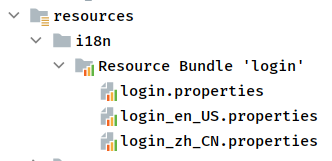

<!--more-->

springboot 优点
- 快速启动程序
- 开箱即用 提供默认配置，提供各种框架方便集成
- 内嵌容器
- 摒弃xml


1. 

# springboot 整合servlet 
热部署工具devtools，JReble

## servlet、Filter、Listner
# 静态文件处理
## WebMvcAutoConfiguration处理静态资源文件
### addResourceHandlers方法
- 判断spring.web.resources.add-mappings 是否启用默认静态资源配置
- 处理webjars
[引入webjars](https://www.webjars.org/)
- 处理resources.properties配置的静态目录
```
"classpath:/META-INF/resources/", 
"classpath:/resources/", 
"classpath:/static/", 
"classpath:/public/"
```

## 欢迎页面处理
`EnableWebMvcConfiguration.welcomePageHandlerMapping`
# springMVC扩展 
自定义WebMvcConfigurer类，可自定义
interceptors, formatters, view controllers等。自定义WebMvcConfigurer使用@Configuration 不用@EnableWebMvc注解。

## 整合servlet
- ServletRegistrationBean方式
- @WebServlet方式
两种方式同时配置，ServletRegistrationBean方式优先级高

### ServletRegistrationBean方式
#### 定义Servlet
```
public class MyServlet extends HttpServlet {
    @Override
    protected void doGet(HttpServletRequest req, HttpServletResponse resp) throws ServletException, IOException {
        System.out.println("MyServlet doGet is functioning");
        super.doGet(req, resp);
    }
}
```
#### 注册bean
```
@Configuration
public class MyServletConfiguration {
    @Bean
    public ServletRegistrationBean<MyServlet> getServletRegistrationBean() {
        ServletRegistrationBean<MyServlet> bean = new ServletRegistrationBean<>(new MyServlet(), "/s2");
        //ServletRegistrationBean<MyServlet> bean = new ServletRegistrationBean<>(new MyServlet());
        bean.setLoadOnStartup(1);
        return bean;
    }
}
```
### WebServlet方式
#### 定义Servlet
```
@WebServlet(name = "myServlet", urlPatterns = "/srv", loadOnStartup = 1)
public class MyServlet extends HttpServlet {
    @Override
    protected void doGet(HttpServletRequest req, HttpServletResponse resp) throws ServletException, IOException {
        System.out.println("MyServlet doGet is functioning");
        super.doGet(req, resp);
    }
}
```
#### 配置扫描
启动类配置注解：@ServletComponentScan


## 视图解析器
`WebMvcAutoConfigurationAdapter.viewResolver`方法注册`ContentNegotiatingViewResolver`
`resolveViewName()`解析视图 

## 视图控制器
### 新增视图控制器 
???
```
@Configuration
public class MyMvcConfigure implements WebMvcConfigurer {
    @Override
    public void addViewControllers(ViewControllerRegistry registry) {
        WebMvcConfigurer.super.addViewControllers(registry);
        registry.addViewController("/vvf").setViewName("welcome");
    }
}
```
### 添加视图文件
添加文件resources/templates/wecome.html

注意事项：添加模版引擎依赖如：
```
<dependency>
    <groupId>org.springframework.boot</groupId>
    <artifactId>spring-boot-starter-thymeleaf</artifactId>
</dependency>
```

# thymeleaf

## pom
```
<dependency>
    <groupId>org.springframework.boot</groupId>
    <artifactId>spring-boot-starter-thymeleaf</artifactId>
</dependency>
```
## controller
```
@Controller
public class ThymeleafController {
    @RequestMapping("hellothymeleaf")
    public String hello(/*Model model*/ ModelMap map, HttpSession session) {
        session.setAttribute("name", "vvf");
        //model.addAttribute("name", "vvf");
        map.put("thText", "加粗文本<b>加粗</b>");
        map.put("thUText", "加粗文本<b>加粗</b");
        map.put("thValue", " input value is thValue");
        map.put("thEach", Arrays.asList("first", "second", "third"));
        map.put("thIfEmpty", "");
        map.put("thIfNotEmpty", "hello");
        map.put("thPerson", new Person("vvf", 31, "男"));

        return "helloThymeleaf";
    }

    @RequestMapping("hello2")
    public String hello2() {
        return "hello2";
    }
}
```
## view
注意事项：引入 `xmln:th:="http://thymeleaf.org"`

```
<!DOCTYPE html>
<html lang="en" xmln:th:="http://thymeleaf.org">
<head>
    <meta charset="UTF-8">
    <title>Title</title>
</head>
<body>
<!--表达式语法-->
<!--<p th:text="${name}"></p>-->
thText：<p th:text="${thText}"></p>
thUText：<p th:utext="${thUText}"></p>
<input type="text" th:value="${thValue}">
<div th:each="message:${thEach}">
    <p th:text="${message}"></p>
</div>
<div>
    <p th:text="${message}" th:each="message:${thEach}"></p>
</div>
<p th:text="${thIfEmpty}" th:if="${not #strings.isEmpty(thIfEmpty)}"></p>
<p th:text="${thIfNotEmpty}" th:if="${not #strings.isEmpty(thIfNotEmpty)}"></p>
<div th:object="${thPerson}">
    <p>name:<span th:text="*{name}"></span></p>
    <p>age:<span th:text="*{age}"></span></p>
    <p>gender:<span th:text="*{gender}"></span></p>
</div>

<div>
    session:<span th:text="${session.name}"></span>
</div>

</body>
</html>
```

# 国际化
## 配置文件
1. application.properties 
spring.messages.basename: i18n/login
2.  resource 文件夹下新建配置文件
    - /i18n/login.properties 添加配置，例如：login.username=hello
    - /i18n/login_zh_CN.properties 添加配置，例如：login.username=飞飞
    - /i18n/login_en_US.properties 添加配置，例如：login.username=vvf
    
    
3. 自定义LocalResolver
```
@Configuration
public class MyMvcConfigure implements WebMvcConfigurer {
    @Override
    public void addViewControllers(ViewControllerRegistry registry) {
        WebMvcConfigurer.super.addViewControllers(registry);
        registry.addViewController("/vvf").setViewName("welcome");
        registry.addViewController("/out").setViewName("out");
        registry.addViewController("/login").setViewName("login");
    }
    @Bean
    public LocaleResolver localeResolver() {
        return new NativeLocaleResolver();
    }

    public static class NativeLocaleResolver implements LocaleResolver {

        @Override
        public Locale resolveLocale(HttpServletRequest request) {
            String languge = request.getParameter("languge");
            Locale locale = Locale.getDefault();
            if (!StringUtils.isEmpty(languge)) {
                String[] split = languge.split("_");
                locale = new Locale(split[0], split[1]);
            }
            return locale;
        }

        @Override
        public void setLocale(HttpServletRequest request, HttpServletResponse response, Locale locale) {

        }
    }
}
```

## view
```
<!DOCTYPE html>
<html xmln:th:="http://thymeleaf.org">
<head>
    <meta charset="UTF-8">
    <title>login</title>
</head>
<body>
<div>
    <span th:text="#{login.username}"></span>
</div>
<a th:href="@{/login(languge='zh_CN')}">中文</a>
<a th:href="@{/login(languge='en_US')}">英文</a>
</body>
</html>
```

# 整合jdbc

## 配置数据源
application.yaml
```
spring:
  datasource:
    username: root
    password: root
    driver-class-name: com.mysql.cj.jdbc.Driver
    url: jdbc:mysql://127.0.0.1:3306/vvf?useSSL=false&useUnicode=true&characterEncoding=UTF-8&serverTimezone=Asia/Shanghai
#    type: com.alibaba.druid.pool.DruidDataSource # 使用druid需引入依赖，默认使用jdbc
```
### 测试连接
```
@SpringBootTest
class ApplicationTests {
    @Autowired
    DataSource dataSource;

    @Test
    void contextLoads() throws SQLException {
        Connection connection = dataSource.getConnection();
        System.out.println(connection);
        System.out.println(connection.getCatalog());
    }
}
```
## 使用JdbcTemplate
```
@RestController
public class TestJDBCController {
    @Autowired
    JdbcTemplate template;

    @RequestMapping("getAll")
    public String getAll() {
        String sql = "select * from v_user";
        List<Map<String, Object>> maps = template.queryForList(sql);
        maps.stream().forEach(x -> {
            x.forEach((y, z) -> {
                System.out.println("key:" + y + " value:" + z);
            });
        });
        return JSONObject.toJSONString(maps);
    }

    @RequestMapping("addOne")
    public int insert() {
        String sql = "insert into v_user (name,sex,aget,birth_day) values(?,?,?,?)";
        int r = template.update(sql, "vvf", "3", 31, "2021-01-01");
        return r;
    }

    @RequestMapping("deleteOne")
    public int delete() {
        String sql = "delete from v_user where id=?";
        int r = template.update(sql, 4);
        return r;

    }

    @RequestMapping("update/{id}")
    public int update(@PathVariable("id") int id) {
        String sql = "update v_user set c1 = ? where id =?";
        int r = template.update(sql, "changedC1", id);
        return r;
    }
}
```
# 整合druid
[中文文档](https://github.com/alibaba/druid/wiki/%E5%B8%B8%E8%A7%81%E9%97%AE%E9%A2%98)

Druid是Java语言中最好的数据库连接池。Druid能够提供强大的监控和扩展功能。

## 添加@Configuration配置类
```

@Configuration
public class DruidConfig {
    @ConfigurationProperties(prefix = "spring.datasource")
    @Bean
    public DataSource druidDataSource() {
        return new DruidDataSource();
    }

    /**
     * 监控配置
     * @return
     */
    @Bean
    public ServletRegistrationBean druidServletRegistrationBean() {
        ServletRegistrationBean<Servlet> servletServletRegistrationBean = new ServletRegistrationBean<>(new StatViewServlet(), "/druid/*");
        Map<String, String> initParams = new HashMap<>();
        initParams.put("loginUsername", "root"); //监控页面账号
        initParams.put("loginPassword", "root"); //监控页面密码
        //initParams.put("allow", "localhost");//只有本机可以访问
        initParams.put("allow", "");//空格或者空表示所有人可以访问
        //initParams.put("msb", "192.168.1.20");// 进制此ip访问  参数：名称 ， ip
        servletServletRegistrationBean.setInitParameters(initParams);
        return servletServletRegistrationBean;
    }


    /**
     * 配置Druid监控之web的监控filter
     * 用于配置Web和Druid数据源之间的管理关联监控统计
     */
    @Bean
    public FilterRegistrationBean webStatFilter() {
        FilterRegistrationBean bean = new FilterRegistrationBean();
        bean.setFilter(new WebStatFilter());
        Map<String, String> initParams = new HashMap<>();
        initParams.put("exclusions", "*.js,*.css,/druid/*");
        bean.setInitParameters(initParams);

        bean.setUrlPatterns(Arrays.asList("/*"));
        return bean;
    }
}
```
## 配置文件
```
spring:
  datasource:
    username: root
    password: root
    driver-class-name: com.mysql.cj.jdbc.Driver
    url: jdbc:mysql://127.0.0.1:3306/vvf?useSSL=false&useUnicode=true&characterEncoding=UTF-8&serverTimezone=Asia/Shanghai
    type: com.alibaba.druid.pool.DruidDataSource # 需引入依赖
    # 配置初始化大小、最小、最大
    initialSize: 1
    minIdle: 10
    maxActive: 100
    maxWait: 6000 #配置获取连接等待超时的时间
    timeBetweenEvictionRunsMillis: 60000 #配置间隔多久才进行一次检测，检测需要关闭的空闲连接，单位是毫秒
#    配置一个连接在池中最小生存的时间，单位是毫秒
    minEvictableIdleTimeMillis: 600000
#    maxEvictableIdleTimeMillis: 900000
    validationQuery: select 1
    testWhileIdle: true
    testOnBorrow: false
    testOnReturn: false
    poolPreparedStatements: true
    maxOpenPreparedStatements: 20
    asyncInit: true
    filters: stat #配置监控统计拦截的filters
```

## 测试配置
```

@SpringBootTest
class ApplicationTests {
    @Autowired
    DataSource dataSource;

    @Test
    void contextLoads() throws SQLException {
        Connection connection = dataSource.getConnection();
        System.out.println(connection);
        System.out.println(connection.getCatalog());
        DruidDataSource druidDataSource = (DruidDataSource) dataSource;
        System.out.println("getMaxIdle:" + druidDataSource.getMaxIdle());
        System.out.println("getMaxActive:" + druidDataSource.getMaxActive());
        System.out.println("getTimeBetweenEvictionRunsMillis:" + druidDataSource.getTimeBetweenEvictionRunsMillis());
        System.out.println("getMinEvictableIdleTimeMillis:" + druidDataSource.getMinEvictableIdleTimeMillis());
    }
}
```
## 监控页面
http://localhost:8080/druid/

# 配置多数据源
？？？???
# spring集成mybatis
## pom
```
        <dependency>
            <groupId>org.mybatis.spring.boot</groupId>
            <artifactId>mybatis-spring-boot-starter</artifactId>
            <version>2.2.2</version>
        </dependency>
```
## application.yaml
```
spring:
  datasource:
    username: root
    password: root
    driver-class-name: com.mysql.cj.jdbc.Driver
    url: jdbc:mysql://127.0.0.1:3306/vvf?useSSL=false&useUnicode=true&characterEncoding=UTF-8&serverTimezone=Asia/Shanghai
#    type: com.alibaba.druid.pool.DruidDataSource # 使用druid需引入依赖，默认使用jdbc
mybatis:
  mapper-locations: classpath:mapper/*.xml
  type-aliases-package: com.vvf.msbspringbootmybatis.testmybatis.entity
```
## mapper类
```
@Mapper
@Repository
public interface UserMapper {
    
    List<User> getAll();

    int add(User user);

    int delete(int id);

    int update(User user);
}
```
## mapper配置文件
```
<?xml version="1.0" encoding="UTF-8"?>
<!DOCTYPE mapper PUBLIC "-//mybatis.org//DTD Mapper 3.0//EN" "http://mybatis.org/dtd/mybatis-3-mapper.dtd">
<mapper namespace="com.vvf.msbspringbootmybatis.testmybatis.mapper.UserMapper">

    <select id="getAll" resultType="map">
        select * from v_user
    </select>

    <insert id="add" parameterType="User">
        insert into v_user (name,aget)values (#{name},#{age})
    </insert>

    <delete id="delete" parameterType="int">
        delete from v_user where id=#{id}
    </delete>

    <update id="update" parameterType="User">
        update v_user set name=#{name} where id=#{id}
    </update>
</mapper>


```
## controller、model

```
@RestController
public class UserController {
    @Autowired
    UserMapper userMapper;

    @RequestMapping("/getAll")
    public String getAll() {
        System.out.println("getAll");
        List<User> r = userMapper.getAll();
        return JSONObject.toJSONString(r);
    }

    @RequestMapping("add")
    public int add() {
        System.out.println("add one");
        User u = new User();
        u.setName("vvfs1");
        u.setAge(100);
        int r = userMapper.add(u);
        System.out.println("add result:" + r);
        return r;
    }

    @RequestMapping("delete")
    public int delete() {
        System.out.println("delete one");
        int r = userMapper.delete(6);
        System.out.println("delete result:" + r);
        return r;
    }

    @RequestMapping("update")
    public int update() {
        System.out.println("update one");
        User u = new User();
        u.setName("vvfs3");
        u.setId(1);
        int r = userMapper.update(u);
        System.out.println("update result:" + r);
        return r;
    }
}

public class User {
    String name;
    Integer age;
    Integer id;

    public User(String name, Integer age, Integer id) {
        this.name = name;
        this.age = age;
        this.id = id;
    }

    public User() {
    }

    public String getName() {
        return name;
    }

    public void setName(String name) {
        this.name = name;
    }

    public Integer getAge() {
        return age;
    }

    public void setAge(Integer age) {
        this.age = age;
    }

    public Integer getId() {
        return id;
    }

    public void setId(Integer id) {
        this.id = id;
    }
}

```


## 使用注解的方式
- 删除application.yaml中mapper-locations配置
- 删除mapper.xml
- 删除@Mappers注解
- 添加@MapperScan("package") // 自动注入包下所有接口
# 表单接收方式
## PathVariable
```
   @GetMapping(value = "/hello/{id}")
    public String hello(@PathVariable("id") Integer id){
        return "ID:" + id;
}
```
## 实体对象接受
### json数据
```

@PostMapping(value = "/user")
public User saveUser2(@RequestBody User user) {
    return user;
}
```
### 普通实体对象
```
@PostMapping(value = "/user")
public User saveUser2(User user) {
    return user;
}
```
## 参数名取值
```
@PostMapping(value = "/post")
public String post(@RequestParam(name = "name") String name,
                   @RequestParam(name = "age") Integer age) {
    String content = String.format("name = %s,age = %d", name, age);
    return content;
}
```
## 文件
### 配置文件
```
spring.http.multipart.maxFileSize=200MB
spring.http.multipart.maxRequestSize=200MB

spring.servlet.multipart.max-request-size = 200MB
spring.servlet.multipart.max-file-size = 200MB
```
### html
```
<form action="fileUploadController" method="post" enctype="multipart/form-data">
		上传文件：<input type="file" name="filename"/><br/>
		<input type="submit"/>
	</form>
```
### controller
```
	@RequestMapping("/fileUploadController")
	public String fileUpload(MultipartFile filename) throws Exception{
		System.out.println(filename.getOriginalFilename());
		filename.transferTo(new File("e:/"+filename.getOriginalFilename()));
		return "ok";
	}
```

# 问题
## springboot的启动过程
## 自动装配原理
### conditional
# 源码解析
## 启动(run方法)
### new SpringApplication()
- 获取 webApplicationType
- 读取配置 META-INF/spring.factories 
    - 文件位置 spring-boot包、spring-boot-autoconfigure包
- 初始化ApplicationContextInitializer类型实例
- 初始化ApplicationListener类型实例
- 获取启动主类 
### run
- 设置java.awt.headless=true 无显示模式
- 获取SpringApplicationRunListener （EventPublishingRunListener）
- EventPublishingRunListener 启动相关ApplicationStartingEvent事件
- new DefaultApplicationArguments(args); （构造方法）解析命令行参数
- prepareEnvironment(listeners, bootstrapContext, applicationArguments);
    - 解析解析servletConfigInitParams、servletContextInitParams、jndiProperties、systemProperties、systemEnvironment
        - 根据webApplicationType类型，创建new ApplicationServletEnvironment() 
        - 创建ApplicationServletEnvironment实例时 StandardServletEnvironment 解析servletConfigInitParams、servletContextInitParams、jndiProperties； StandardEnvironment解析systemProperties、systemEnvironment
            - (ApplicationServletEnvironment extens StandardServletEnvironment extens  StandardEnvironment extens AbstractEnvironment  AbstractEnvironment 构造方法调用customizePropertySources())
    - configureEnvironment 解析命令行参数、解析profile(空方法？)
    - listeners.environmentPrepared 筛选支持ApplicationEnvironmentPreparedEvent事件的listners执行listner对应的onApplicationEvent方法
        - EnvironmentPostProcessorApplicationListener 获取ConfigDataEnvironmentPostProcessor ,YamlPropertySourceLoader解析.yaml/.yml配置文件(PropertiesPropertySourceLoader解析 .properties/.xml配置文件)
        - 2.4之前版本使用configFileApplicationListner 处理配置文件
    - 加载banner 配置：
    `spring:banner:location:banner.txt;  spring:banner:image:location:banner.png;`
    - 创建上下文对象
    createApplicationContext 
        1. 读取ApplicationContextFactory类型的listner，根据webApplicationType筛选listner
        2. 创建的AnnotationConfigServletWebServerApplicationContext，包含reader、scaner
            - reader: bean注册，包含condition判断
            - scaner: 包扫描，扫描@Controller、@Service等
    - 准备上下文对象
    prepareContext（注入[初始化]属性值）
        - applyInitializers():应用所有初始化器（创建application对象时，读取的spring.factories配置的ApplicationContextInitializer）
        initializer的作用：注册listner和postprocess
        ```
        Initializers
        org.springframework.context.ApplicationContextInitializer=\
        org.springframework.boot.autoconfigure.SharedMetadataReaderFactoryContextInitializer,\
        org.springframework.boot.autoconfigure.logging.ConditionEvaluationReportLoggingListener
        Application Context Initializers
        org.springframework.context.ApplicationContextInitializer=\
        org.springframework.boot.context.ConfigurationWarningsApplicationContextInitializer,\
        org.springframework.boot.context.ContextIdApplicationContextInitializer,\
        org.springframework.boot.context.config.DelegatingApplicationContextInitializer,\
        org.springframework.boot.rsocket.context.RSocketPortInfoApplicationContextInitializer,\
        org.springframework.boot.web.context.ServerPortInfoApplicationContextInitializer
        ```
        - listeners.contextPrepared(context); 获取支持ApplicationContextInitializedEvent事件的listners[spring.factories文件中 key为org.springframework.context.ApplicationListener]并执行
        - context.addBeanFactoryPostProcessor(new PropertySourceOrderingBeanFactoryPostProcessor(context));
        - load ，注册Application对象
        - listeners.contextLoaded(context);
            - 获取支持ApplicationPreparedEvent事件的listner，执行onApplicationEvent方法
        
# spring事件机制

## 事件类型

ApplicationStartingEvent
ApplicationEnvironmentPreparedEvent 
ApplicationPreparedEvent
ApplicationContextInitializedEvent
ApplicationReadyEvent 
ApplicationStartedEvent 
ApplicationFailedEvent 

## 监听器listner
定义在spring-boot.jar,spring-boot-autoconfigure.jar 的/META-INF/spring.factories文件中

一个listner可支持多种事件类型
